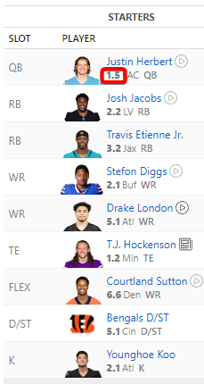
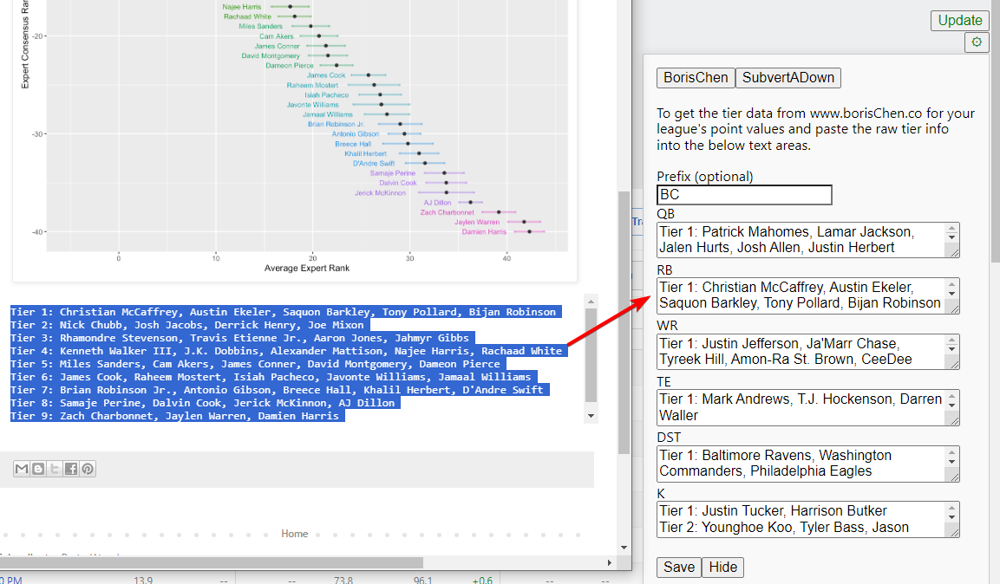
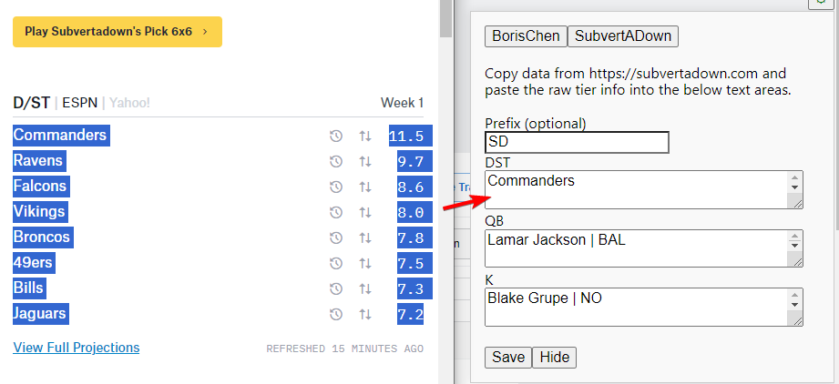

# FUSE
FUSE (Fantasy User Stat Enhancer)

FUSE lets you enhance player stats in your fantasy football app by layering in your own custom data. Currently, extending ESPN player names is supported with the following capabilities

- Borischen tiers
- SubvertADown streaming values

Check out the example below



## Copying data
Copying data is done manually by copying and pasting the data from a given site. FUSE includes some logic to transform the pasted text into something which can be used to extend ESPN player info.

### Borischen
Go to the position page in [borischen.co](http://www.borischen.co/) that's relevant for your league's scoring rules and copy the data over to FUSE.

You may need to tweak some player names if they differ from what's shown in ESPN, otherwise FUSE info won't be added. For example Borischen shows `Patrick Mahomes II` while ESPN omits the `II`.



### SubvertADown
Go to [subvertadown.com](https://subvertadown.com/) and copy the position stats on the home page over to FUSE. The full projection page tables are not supported.



## Install instructions 

At this time, this is just a bit of javascript, so you can either copy it into chrome dev tools and run it manually or use the JS bookmarklet example below.

### Bookmarklet

1. Create a new bookmark in your bookmarks bar.
2. Edit the bookmark and set the title to "FUSE" or your preferred name.
3. Copy and Paste the following code into the URL/location field:


#### Latest Version
This grabs the latest version each time you click on the bookmarklet

```javascript
javascript: (async function() {
    'use strict';

    try {
        const response = await fetch('https://api.github.com/repos/jarekb84/FUSE/releases/latest');
        const data = await response.json();    
            
        let fuseAsset = data.assets.find(asset => asset.name === 'fuse.js');    
    
        if (fuseAsset) {        
            let script = document.createElement('SCRIPT');
            script.src = fuseAsset.browser_download_url;
            script.type = 'text/javascript';
            document.getElementsByTagName('head')[0].appendChild(script);
        } else {
            Alert('fuse.js asset not found in the latest release.');
        }
    } catch (error) {
       alert('Error fetching the latest release from GitHub: ' + error)
    }
})();
```

#### Static Version
If you want to grab just a specific version, use the following code.

Just updated the `v0.1.0` to the version you want found in https://github.com/jarekb84/FUSE/releases

```javascript
javascript: (function() {
  'use strict';
  var script = document.createElement('SCRIPT');
  script.src =
    'https://github.com/jarekb84/FUSE/releases/download/v0.1.0/fuse.js';
  script.type = 'text/javascript';  
  document.getElementsByTagName('head')[0].appendChild(script);
})();
```

